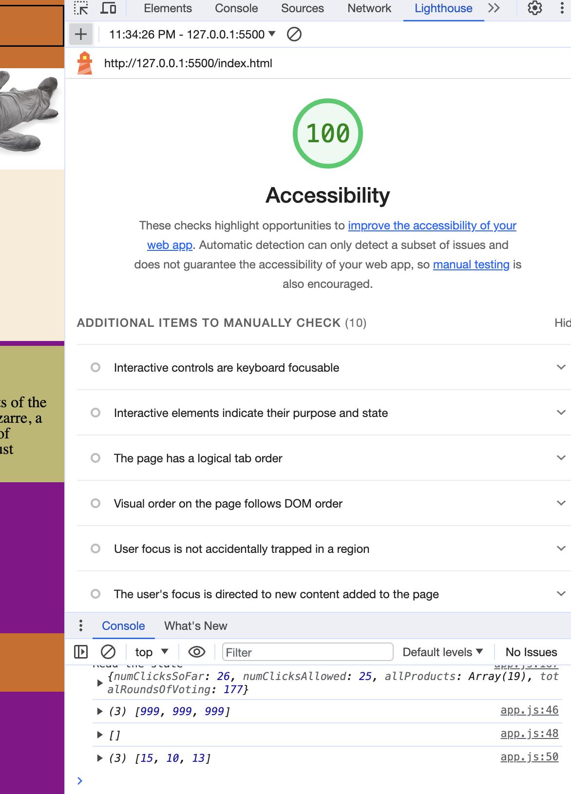

# LAB - 13 Odd Duck

## Adding Local Storage

Keeoing track of multiple rounds of voting.

### Author: Johnny Backus

### Links and Resources

* About Us authored by ChatGPT

### Lighthouse Accessibility Report Score

### Reflections and Comments
This went pretty well overall, although with all of the other assignments, I'm not spending as much time with this lab as I would have liked. Anywho, the HTML and JS work. Each set of three images will be different from the previous three. I also added a counter for total rounds of voting just for giggles, which I may display somehwere if I find some time. I still have a fair bit of work to do on the CSS.

One important lesson learned is that if you make a syntax error on a line of code that is only read conditionally and that condition is dependent on a random number, and the error causes the site to freeze, but doesn't create an error message, it can take a looong time to figure out.

The garish colors seemed fitting for such a weird company, but they definitely make my eyes bleed as well. I have no idea how I keep getting a 100 accessibility score. It must not be accounting for my chart labels.

This lab represents about 3 hours of effort, which is about what I expected (and with the expectation that I would not get to fixing the CSS today.)
