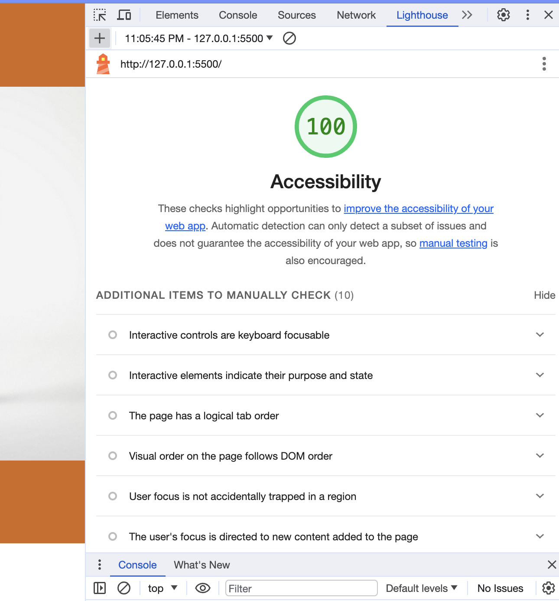

# LAB - 11 Odd Duck

## Odd Duck Products

Setting up a voting system for beloved products.

### Author: Johnny Backus

### Links and Resources

* About Us authored by ChatGPT

### Lighthouse Accessibility Report Score

### Reflections and Comments
I'm not there yet. I spent too long working on the grid layout (making grids within grids), but I do think the structure of this page is pretty solid. Still need to complete functions to render results, but not too far away. My styling in the preview is better in the GoLive than what is showing up on the deployed page, so I'm not sure what is going on there. This assignment took me about four and a half hours so far. My progress feels fairly in line with where I'd expect to be at this point.
